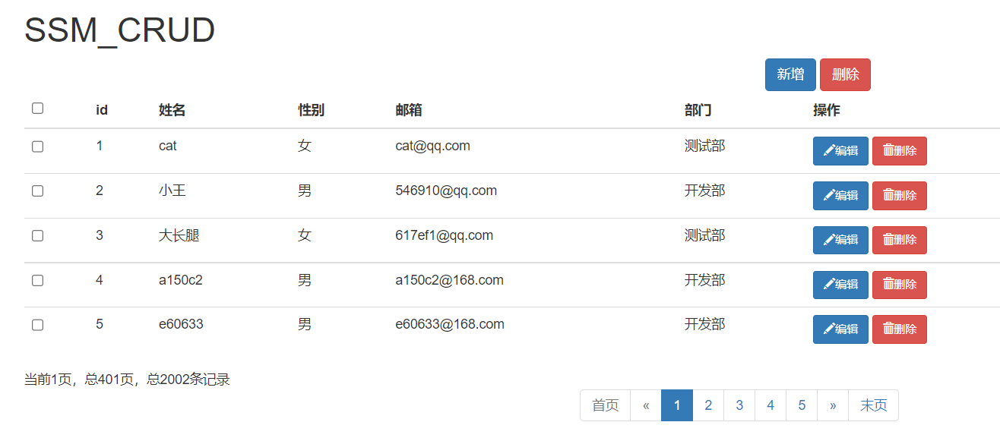
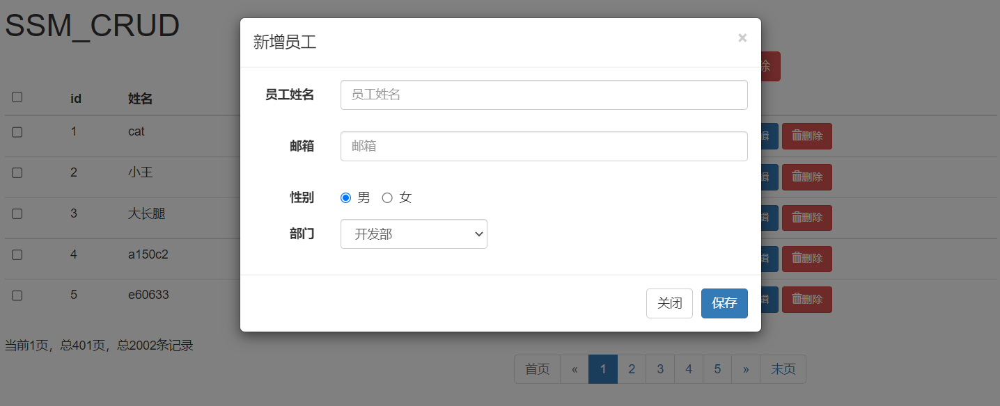
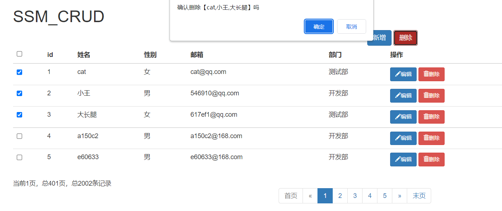
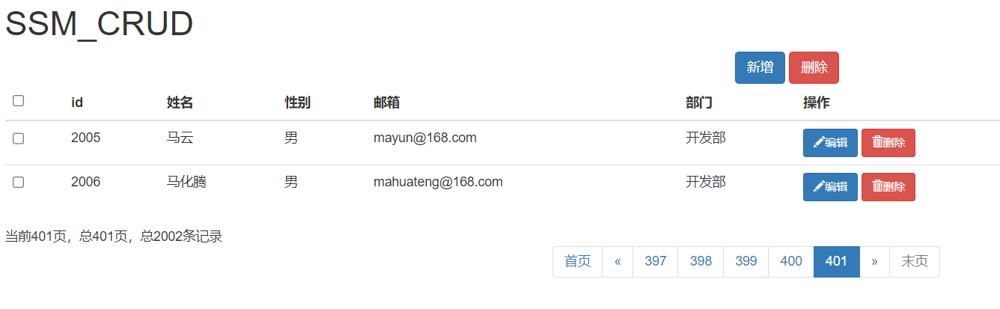
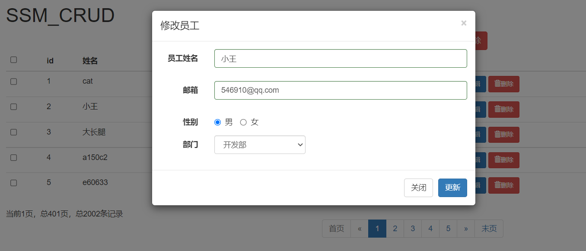

# SSM_CRUD

使用ssm框架开发的一个简单的CRUD小项目

## 开发环境

### 开发工具

- jdk 1.8
- Tomcat 8.5.81

- idea 2021.3.3

- Maven 3.8.5

- 数据库 MySQL8.0

- UI bootstrap3.4.1

- 前端框架 JQuery3.6.0

- 数据交互 Ajax

### 所需依赖

- spring-webmvc  5.3.18
- spring-jdbc  5.3.18
- spring-aspects  5.3.18
- mybatis  3.5.7
- mybatis-spring  1.3.1
- druid  1.2.10
- mysql-connector-java  8.0.28
- servlet-api  3.1.0 provided
- thymeleaf-spring5   3.0.12.RELEASE
- javax.servlet-api  3.1.0  provided
- mybatis-generator-core 1.3.5
- junit 4.12
- pagehelper  5.2.0
- jackson-databind 2.12.1
- spring-test 5.3.18

## 实现功能

增删改查，分页，数据校验等

